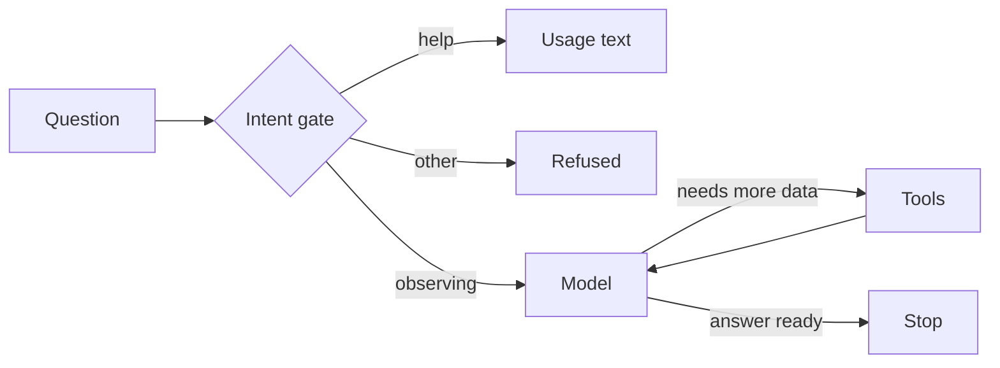

# Clear Sky Observing Advisor

Decides whether tonight is good for telescope observing, using a tool-calling
agent loop.

- **Package:** `star_gazing_weather_agent` (src layout)
- **CLI:** `star-gazing-weather-agent` console script or `python -m star_gazing_weather_agent`
- **Public API:** `ask_agent(question)` (async) and `service.ask(question)` (sync);
  both take an injectable model callable, so tests drive a fake model end to end



A cheap intent gate first decides whether the question is about observing
(OBSERVE), tool usage (HELP), or neither (refused) — the observing loop only
runs for OBSERVE. The gate returns an `Intent` enum, and the orchestrator
routes on it with one `match`.

## Architecture

Layers are strictly separated, with the UI at the top and the model seam at
the bottom:

```
cli (Typer + Rich)                      → renders, exit codes, nothing else
  → service.ask (sync)                  → settings bootstrap + asyncio.run bridge
    → agents.ask_agent (async)          → routes the Intent, plain function
      → StarGazingIntentClassifier      → OBSERVE / HELP / OTHER
      → StarGazingWeatherAgent          → tool-grounding loop
        → _call_llm                     → injected model callable (AgentBase)
```

The observing loop is a small state machine: wait for the model, execute any
requested tools, feed the results back — repeating until the model answers
grounded in tool observations, or formally refuses with a `REFUSED:` prefix.
Replies that dodge the tools are steered back onto them. Narration text is
filtered out of the transcript mid-loop. The whole layer under `service.ask`
is async and free of Typer/Rich, so any front end can drive it.

## Tools

- `get_forecast` — real data from 7Timer's ASTRO product (free, no API key;
  GFS-derived, 3-day range at 3-hourly steps)
- `get_moon_phase` — still a stub (fixed 60% illumination)
- `get_todays_date` — resolves an observing location to its timezone for the
  correct locale date

## Setup

```bash
make env    # copies .env.tmp to .env — then edit it
uv sync
```

The agent calls the model through LiteLLM, which supports any of its many
providers (Groq, OpenAI, Anthropic, local endpoints, ...). Fill `API_KEY`,
`PROVIDER` and `MODEL` in `.env` with a key that the provider you picked
accepts — then run the agent.

## Run

```bash
uv run star-gazing-weather-agent "Is tonight good at Mauna Kea?"
```

## Gates

```bash
make format     # ruff format + import order + sorted __all__
make typecheck  # mypy
make test       # pytest
```