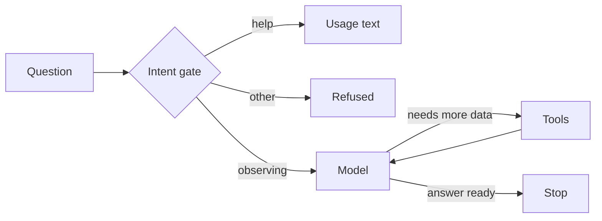

# Clear Sky Observing Advisor

Decides whether tonight is good for telescope observing, using an agent loop
with tool calls.

- **Package:** `star_gazing_weather_agent` (src layout)
- **CLI:** `star-gazing-weather-agent` console script or `python -m star_gazing_weather_agent`
- **Tools:** forecast and moon-phase stubs, plus `get_todays_date` which
  resolves an observing location to its timezone for the correct locale date



A cheap intent gate first decides whether the question is about observing
(OBSERVE), tool usage (HELP), or neither (refused) — the observing loop only
runs for OBSERVE.

## Setup

```bash
make env    # copies .env.tmp to .env — then edit it
uv sync
```

The agent calls the model through LiteLLM, which supports any of its many
providers (Groq, OpenAI, Anthropic, local endpoints, ...). Fill `API_KEY`,
`PROVIDER` and `MODEL` in `.env` with a key that the provider you picked
accepts — then run the agent.

## Run

```bash
uv run star-gazing-weather-agent "Is tonight good at Mauna Kea?"
```

## Gates

```bash
make format     # ruff format + import order + sorted __all__
make typecheck  # mypy
make test       # pytest
```